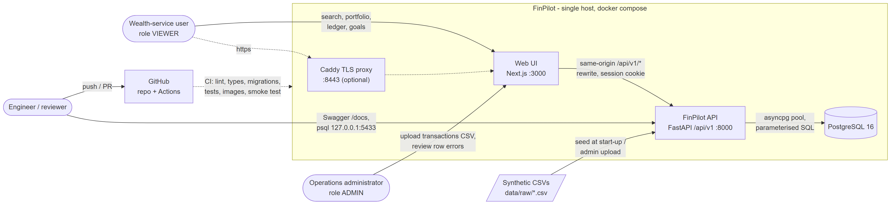
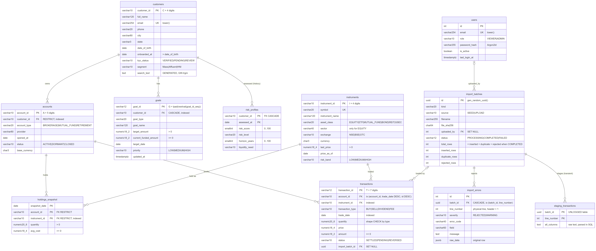
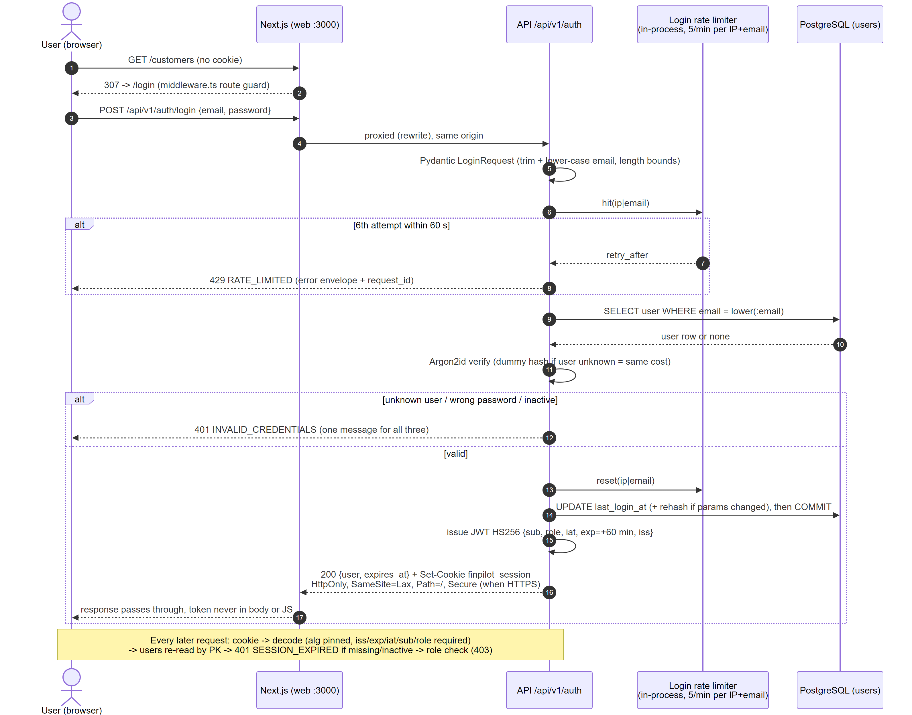
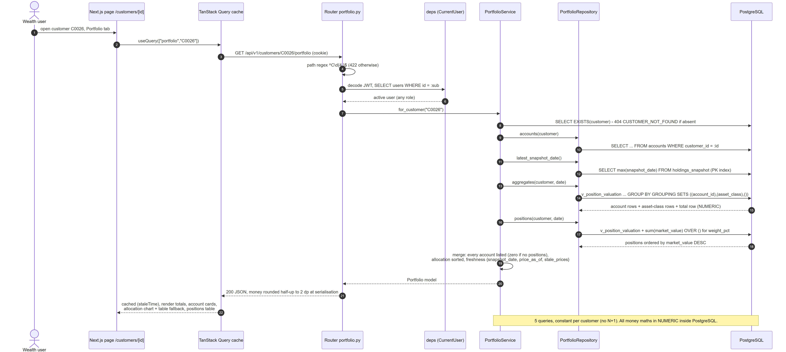
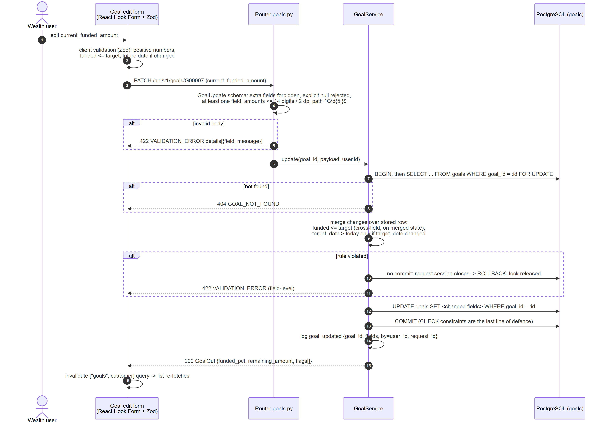
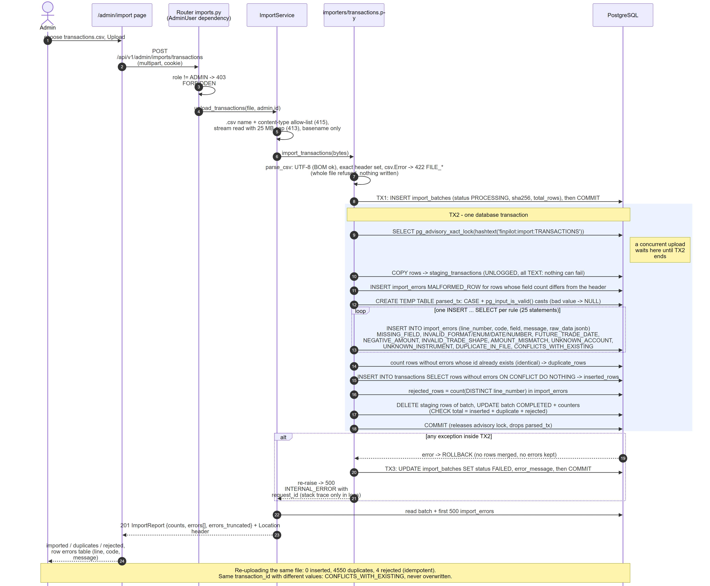
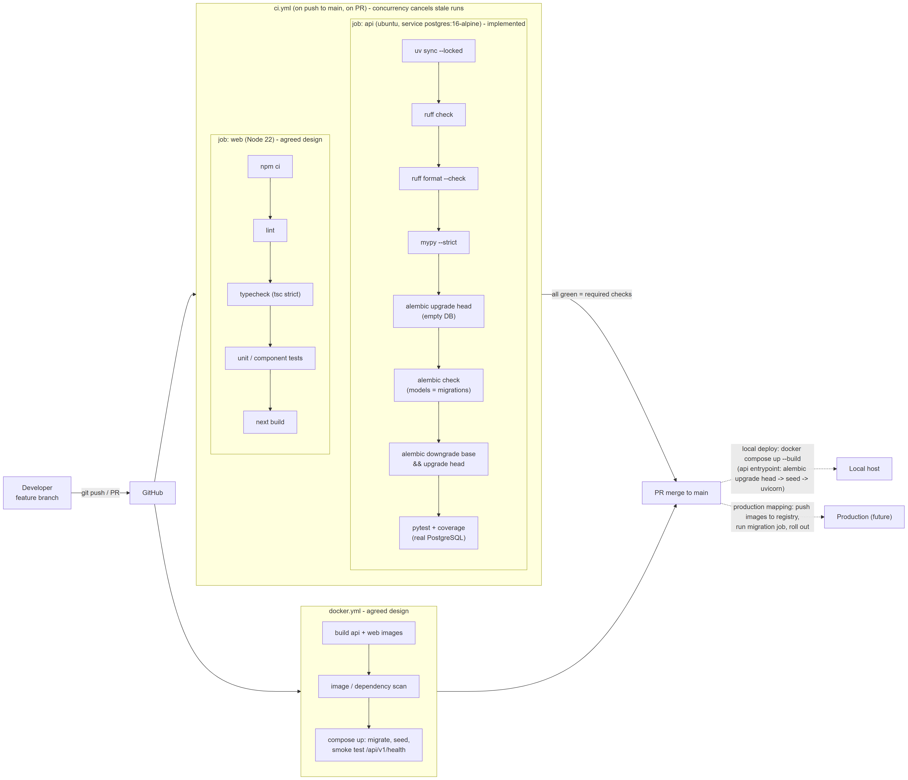
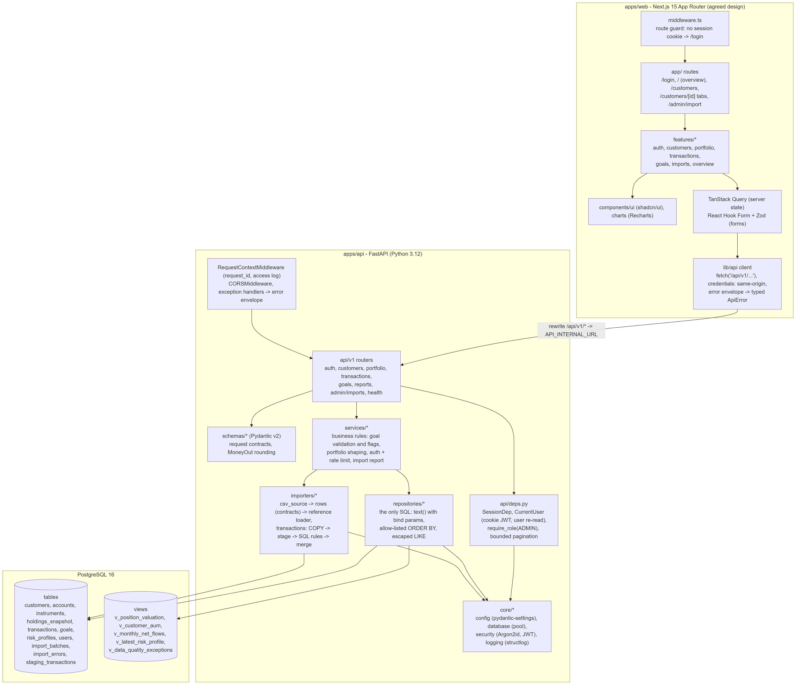
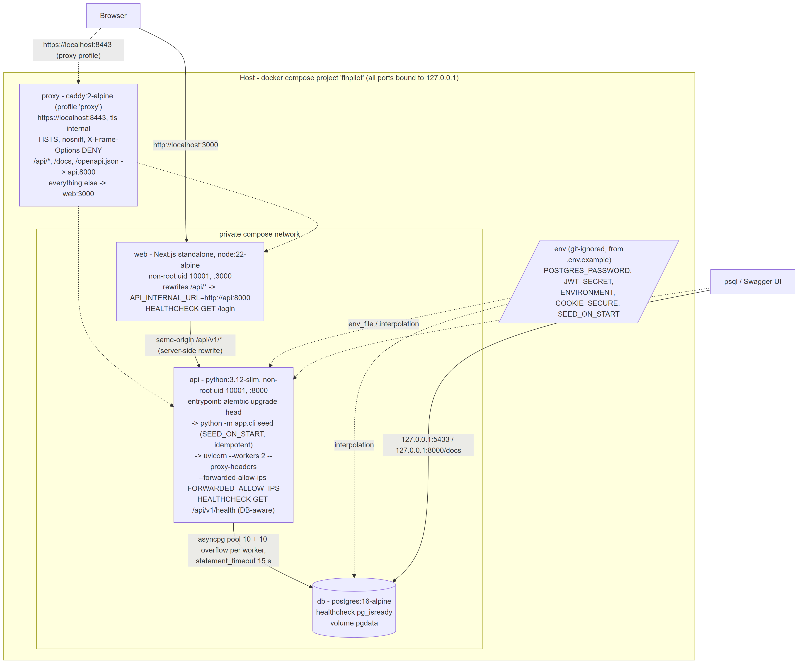

# FinPilot: Architecture and Design Report

Investment portfolio and goal monitoring for an internal wealth-service team. All data is synthetic.

**Scope of this report.** The API, database, import pipeline, tests, container images, compose
stack, TLS proxy and both CI workflows are described from the code on `main`. The Next.js web
app was still being built when this was written, so it is described as the agreed design and
marked *(design)*. Companion documents: `DECISIONS.md` (assumptions, omissions, limitations,
13 ADRs), `docs/performance/query-plans.md` (EXPLAIN evidence), `docs/sql/reviewer-queries.sql`
(SQL tasks with results), `docs/api/openapi.json` (OpenAPI 3.1).

## 1. Executive overview

**Problem.** A service user needs one trustworthy view of a customer's accounts, positions,
valuation, transactions, risk profile and goals. An operations administrator needs to load CSV
files without duplicates or silently accepted bad rows. The supplied data is deliberately
imperfect, so the system must say what it rejected and why.

**Scope delivered.** VIEWER/ADMIN login; customer search and profile; server-side portfolio
valuation with freshness dates; filtered, paginated ledger; validated goal create/edit with
flags; admin transaction import with row-level errors; firm overview; health, JSON logs, CI,
containers. Out of scope: execution, payments, advice, real-time prices, notifications,
multi-tenancy, Kubernetes, microservices.

**Stack.** PostgreSQL 16 · Python 3.12, FastAPI, Pydantic v2, SQLAlchemy 2 async + asyncpg,
Alembic · Argon2id + HS256 JWT in an HttpOnly cookie · Next.js 15, TypeScript, Tailwind,
shadcn/ui, TanStack Query, React Hook Form + Zod, Recharts *(design)* · Docker Compose with an
optional Caddy TLS proxy · GitHub Actions.

**Major decisions** (ADRs in `DECISIONS.md`):

1. **The database enforces the domain:** natural keys, `VARCHAR + CHECK` vocabularies, `NUMERIC`
   money, cross-column `CHECK`s. Application validation mirrors them for readable errors.
2. **All money arithmetic in PostgreSQL `NUMERIC`** (views, `GROUPING SETS`, window functions);
   Python rounds half-up to 2 dp only at serialisation.
3. **Import = stage -> validate in SQL -> merge, in one transaction, with partial acceptance.**
   Good rows load, bad rows are quarantined with line, code and raw row. Re-import is idempotent;
   a known id with different values is rejected, never overwritten.
4. **Portfolio valued from the holdings snapshot, not the ledger**, because the ledger does not
   reconcile to it (section 4.4).
5. **Same-origin deployment:** the browser only calls the web origin; Next.js rewrites
   `/api/v1/*` to the API, so the session cookie is first-party.

## 2. System context



Actors: VIEWER (reads everything, maintains goals), ADMIN (also imports transactions) and the
engineer/reviewer (Swagger `:8000/docs`, `psql` on `127.0.0.1:5433`, GitHub Actions). The CSVs
are baked into the API image and seeded idempotently at start-up. **No runtime external
dependencies** (market data, IdP, e-mail, cloud); build time needs PyPI, npm, Docker Hub, GitHub.

## 3. Component architecture

Backend layers (diagram in Appendix A), dependencies point inward only:

| Layer | Package | Responsibility |
|---|---|---|
| Transport | `api/v1/*`, `api/deps.py` | Routes, status codes, auth dependencies (`CurrentUser`, `AdminUser`), bounded pagination, path regexes. No SQL |
| Contracts | `schemas/*` | Pydantic models: `extra="forbid"` on writes, enums, decimal precision, money serialisation |
| Services | `services/*` | Business rules: goal rules on the merged row and flags, portfolio shaping and freshness, login + rate limit, import report |
| Data access | `repositories/*` | **The only SQL.** Bind parameters, allow-listed `ORDER BY`, one round trip per concern |
| Ingestion | `importers/*` | CSV parsing with physical line numbers, row contracts, reference loader, transaction stage/validate/merge, batch audit. Shared by the HTTP endpoint and the seed CLI |
| Core | `core/*` | Settings (with production guards), pooled engine, error envelope, request-id middleware, logging, Argon2id/JWT |

**Data-access boundary.** Aggregates live in views (`v_position_valuation`, `v_customer_aum`,
`v_monthly_net_flows`) so the API, the overview report and the reviewer SQL share one definition.
There are no per-row queries: the portfolio endpoint issues 5 queries whatever the position count;
the customer list issues 1 (page and total via `count(*) OVER ()`).

**Frontend modules** *(design)*: `middleware.ts` route guard (no session cookie -> `/login`; the
API still enforces auth); routes `/login`, `/` overview, `/customers`, `/customers/[id]`
(overview/portfolio/transactions/goals tabs), `/admin/import`; feature folders `auth`,
`customers`, `portfolio`, `transactions`, `goals`, `imports`, `overview`, each owning its query
hooks, components and Zod schemas; a typed `lib/api` client calling same-origin `/api/v1/*` and
mapping the error envelope; TanStack Query for all server state; ledger filters in the URL.

## 4. Data model



### 4.1 Keys, cardinalities and constraints

* **Customer 1 - 0..n** accounts, goals, risk profiles; **account 1 - 0..n** holdings and
  transactions; **instrument 1 - 0..n** holdings and transactions; **import batch 1 - 0..n**
  import errors and (lineage) transactions; **user 1 - 0..n** batches.
* **Natural primary keys** (`C0026`, `A00034`, `I0049`, `T0000026`); composite where identity is
  composite: `holdings_snapshot (snapshot_date, account_id, instrument_id)` makes a duplicate
  position impossible; `risk_profiles (customer_id, assessed_at)` keeps history and
  `v_latest_risk_profile` picks the latest. `goals.goal_id` defaults to
  `'G' || lpad(nextval('goal_id_seq'), 5, '0')`; surrogate keys only for users and import tables.
* **`ON DELETE RESTRICT`** for financial facts, **`CASCADE`** only for customer-owned descriptive
  data (goals, risk profiles).
* **Types:** money `NUMERIC(18,2)`, prices `NUMERIC(18,4)`, quantities `NUMERIC(20,6)`.
* **CHECKs:** every vocabulary (`kyc_status IN (...)`, `asset_class`, `transaction_type`, ...),
  id formats (`customer_id ~ '^C[0-9]{4,}$'`), `onboarded_at > date_of_birth`, sector iff EQUITY,
  transaction shape (BUY/SELL need quantity and price > 0; DIVIDEND/FEE need both = 0),
  `amount >= 0`, goal `target_amount > 0`, and the audit rule
  `total_rows = inserted_rows + duplicate_rows + rejected_rows` for a COMPLETED batch.
* **Unique:** `customers.email`, `users.email` (both lower-case by CHECK), `instruments.symbol`.

### 4.2 Indexes and the query each serves

| Index | Query served | Measured (3M transactions) |
|---|---|---|
| `transactions (account_id, trade_date DESC, transaction_id DESC)` | Customer ledger page in default order; `count(*)` index-only; single-account filter needs no sort | 362 -> 1.3 ms; count 280 -> 0.2 ms |
| GIN `customers.search_text gin_trgm_ops` (stored generated lower(id, name, e-mail, city)) | `LIKE '%term%'` search | 29 -> 0.21 ms |
| `accounts (customer_id)` | Every customer-scoped read | portfolio 18 -> 0.39 ms |
| PK `holdings_snapshot` | `max(snapshot_date)` and an account's positions on a date | - |
| `transactions (trade_date)` | Date-bounded reports | flows 1,276 -> 414 ms |
| `transactions (instrument_id)`, `holdings (instrument_id)`, `goals (customer_id)`, `import_batches (kind, started_at DESC)`, `import_errors (batch_id, line_number)` | Instrument filter / holder counts / FK checks, goal list, import history, error pages | - |

Plans, buffers and the remaining bottlenecks are in `docs/performance/query-plans.md`.

### 4.3 Views

`v_position_valuation` (cost basis, market value, unrealised P&L per position; inlined by the
planner so customer predicates reach the indexes), `v_customer_aum`, `v_latest_risk_profile`,
`v_monthly_net_flows` (SETTLED BUY - SELL by month) and `v_data_quality_exceptions` (import
rejections plus reconciliation rules). Plain views: always fresh, milliseconds at this volume.
Money is rounded per figure at the API boundary, so displayed parts may differ from a displayed
total by up to 0.01 each.

### 4.4 Data-quality findings and handling

Line numbers are physical file lines (header = 1); every case is pinned by a test.

| Finding | Rows | Handling and reason |
|---|---|---|
| holdings: duplicate positions A00147/I0049, A00145/I0036, A00146/I0010 (lines 984–986; first seen 836, 830, 833) | 3 | **Rejected** `DUPLICATE_IN_FILE`, first kept: summing would double-count value. 985 -> 982 loaded |
| transactions: `T0000026` repeated (line 4552; first on 27) | 1 | **Rejected** `DUPLICATE_IN_FILE`: one id, one event |
| transactions: `T0004551` instrument `I9999` (4553) | 1 | **Rejected** `UNKNOWN_INSTRUMENT` |
| transactions: `T0004552` FEE amount -75.00 (4554) | 1 | **Rejected** `NEGATIVE_AMOUNT`: direction comes from the type; not auto-corrected |
| transactions: `T0004553` dated 2027-01-05 (4555) | 1 | **Rejected** `FUTURE_TRADE_DATE` (after the import business date) |
| Trades before the account's `opened_at` | 1,069 | **Loaded, flagged** in `v_data_quality_exceptions`: plausible back-dating; rejecting 23 % of the ledger would hide more than it protects. Business decision needed |
| Trades on CLOSED/DORMANT accounts | 311 | **Loaded**; listed by reviewer query Q6d (historic trades are legitimate) |
| Goals whose name describes another type (e.g. TRAVEL named "Personal Education") | 149 of 177 | **Loaded, flagged** `NAME_TYPE_MISMATCH`: the type drives behaviour |
| Snapshot vs ledger: 0 of 982 positions equal settled net BUY - SELL; 1,187 of 3,068 ledger pairs would be net short | all | **Valuation from the snapshot**; ledger shown as history; gap queryable (Q6e) |

Outcome: transactions 4,554 -> 4,550 loaded, holdings 985 -> 982; other files load fully. AUM
52,754,963.60 INR across 113 customers with positions (7 have accounts but no positions and get a
zero portfolio); top customer C0026 (1,953,574.59).

## 5. API design

| Method | Path (`/api/v1`) | Role | Purpose |
|---|---|---|---|
| GET | `/health` | public | Liveness + DB check; 200 or 503, no secrets |
| POST | `/auth/login`, `/auth/logout`; GET `/auth/me` | public / any | Session cookie set/clear; current user |
| GET | `/customers` | any | `search`, `kyc_status`, `segment`, `sort`, `page`, `page_size`; includes AUM |
| GET | `/customers/{id}` | any | Profile + latest risk |
| GET | `/customers/{id}/portfolio` | any | Totals, accounts, allocation, positions, freshness |
| GET | `/customers/{id}/transactions` (+ `/facets`) | any | Date range, account, instrument, repeated type/status, sort; facet counts |
| GET / POST | `/customers/{id}/goals` | any | List with funded % and flags / create (201 + `Location`) |
| PATCH | `/goals/{goal_id}` | any | Partial update, rules on merged state |
| GET | `/reports/overview` | any | Firm headline, top customers, allocation, flows, holders, underfunded goals, DQ counts |
| POST | `/admin/imports/transactions` | ADMIN | Multipart CSV import -> 201 report |
| GET | `/admin/imports`, `/{id}`, `/{id}/errors` | ADMIN | History, batch, paged row errors |

* **Auth:** HttpOnly session cookie (section 8); 401 unauthenticated, 403 wrong role.
* **Validation:** Pydantic at the edge (path regexes, enums, lengths, decimal precision,
  `extra="forbid"`, explicit `null` rejected on PATCH); domain rules in services (funded <= target
  on the merged row; only a *changed* `target_date` must be in the future); DB `CHECK`s as backstop.
* **Pagination:** `page` <= 100,000, `page_size` <= 100; response `{page, page_size, total, pages}`;
  every ordering ends in a unique key so pages never overlap.
* **Errors:** one envelope for every non-2xx; stable `code`s (`CUSTOMER_NOT_FOUND`,
  `INVALID_CREDENTIALS`, `RATE_LIMITED`, `FILE_HEADER_INVALID`, ...); 500s are generic, the stack
  trace is logged under the same `request_id` that is returned in `X-Request-ID`:

```json
422  {"error": {"code": "VALIDATION_ERROR",
                "message": "current_funded_amount cannot exceed target_amount",
                "request_id": "req_3f2a9c1b7d4e5f60",
                "details": [{"field": "current_funded_amount",
                             "message": "current_funded_amount cannot exceed target_amount"}]}}
```

* **Versioning:** URI prefix `/api/v1`; additive changes stay in v1, breaking changes go to
  `/api/v2` side by side. The OpenAPI 3.1 file is generated from code and committed, with real
  examples for the portfolio and import endpoints.

## 6. Workflows

### 6.1 Login



### 6.2 Customer portfolio read



### 6.3 Goal update



`SELECT ... FOR UPDATE` serialises concurrent saves of one goal, but there is no version token,
so a stale form can overwrite a newer change (roadmap).

### 6.4 CSV import



Guarantees, each tested: a structurally invalid file (encoding, header, > 25 MB, not CSV) is
refused whole with nothing written; a row with the wrong field count is `MALFORMED_ROW`; every
other violated rule is recorded per row (MISSING_FIELD, INVALID_FORMAT/ENUM/DATE/NUMBER,
FUTURE_TRADE_DATE, NEGATIVE_AMOUNT, INVALID_TRADE_SHAPE, AMOUNT_MISMATCH, UNKNOWN_ACCOUNT,
UNKNOWN_INSTRUMENT, DUPLICATE_IN_FILE, CONFLICTS_WITH_EXISTING) and the rest loads; re-uploading
the supplied file yields 0 inserted / 4,550 duplicates / 4 rejected; the advisory lock makes
concurrent classification exact; a failed merge rolls back fully and leaves a `FAILED` batch.
Validation runs in SQL because FK and duplicate checks are set operations against large tables;
`pg_input_is_valid()` turns bad values into reported errors instead of aborted transactions.
Reference files use the same audit tables via Pydantic row contracts and are loaded by the seed.

### 6.5 CI/CD



`ci.yml` (every PR and push to `main`): locked install, ruff lint and format, `mypy --strict`,
`alembic upgrade head` on an empty PostgreSQL 16 service, `alembic check` (model drift),
`downgrade base` + `upgrade head`, pytest with coverage against real PostgreSQL. `docker.yml`:
builds the API and web images with BuildKit cache, Trivy-scans the API image (CRITICAL/HIGH,
report-only; action pinned to a commit SHA), then a compose smoke test (db + api with throw-away
secrets: wait for healthy, `/health` reports the database healthy, demo login returns 200). A web
lint/typecheck/test job is *(design)*. Deployment is `docker compose up --build`: the API
container migrates, seeds idempotently, then serves.

## 7. Deployment topology

Diagram in Appendix A. `docker compose up --build` starts three services; `--profile proxy`
adds a fourth. **All published ports bind to 127.0.0.1.**

| Service | Image | Host port | Start-up and health |
|---|---|---|---|
| `db` | `postgres:16-alpine`, volume `pgdata` | 5433 | `pg_isready` healthcheck |
| `api` | `python:3.12-slim` multi-stage, uv-locked, non-root (uid 10001), CSVs baked in | 8000 | Starts when db is healthy. Entrypoint: `alembic upgrade head` -> seed (if `SEED_ON_START`) -> `uvicorn --workers 2 --proxy-headers`. `HEALTHCHECK` = `/api/v1/health` (fails if the DB is unreachable) |
| `web` | Next.js standalone on `node:22-alpine`, non-root | 3000 | Starts when api is healthy; rewrites `/api/*` to `API_INTERNAL_URL=http://api:8000`; healthcheck `GET /login` |
| `proxy` (profile) | `caddy:2-alpine`, `tls internal` | 8443 | `https://localhost:8443`; `/api/*` and docs to api, rest to web; HSTS, nosniff, frame-deny headers |

**Secrets/config:** environment only (pydantic-settings); `.env` is git-ignored; `.env.example`
ships clearly labelled local-only values so `cp .env.example .env && docker compose up` works.
Compose overrides `DATABASE_URL` to the in-network host `db`; Alembic reads the same setting.
**Environments:** `local`, `test` (pytest builds `finpilot_test`), `ci`, `production`
(no demo users, start-up refuses development secrets and `COOKIE_SECURE=false`).

**Production mapping:** managed PostgreSQL 16 (Multi-AZ, automated backups + PITR, private
subnet, TLS); the same API/web images on a container platform behind a managed load balancer
with real certificates and SSO in front; migrations as a one-off release job (`SEED_ON_START=false`);
secrets from a secrets manager; separate DB roles for DDL (migrations) and DML (runtime); logs
shipped to a central store.

## 8. Security

| Concern | Control |
|---|---|
| Authentication | Argon2id hashes (rehashed on login when parameters change). Identical 401 for unknown user, wrong password and inactive user; a dummy hash is verified for unknown e-mails to equalise timing. Login limit 5 attempts / 60 s per client IP + e-mail, held in memory per uvicorn worker |
| Session | HS256 JWT with pinned algorithm and required `iss/exp/iat/sub/role`, 60 min, only in an `HttpOnly; SameSite=Lax` cookie (`Secure` over HTTPS), never in a body or `localStorage`. The user row is re-read per request, so deactivation and role changes apply immediately |
| Authorisation | Role dependencies on routes (`AdminUser`); VIEWER reads and maintains goals, only ADMIN imports (tested both ways) |
| Input validation | Pydantic contracts on every input, bounded lengths and page sizes, decimal precision, `extra="forbid"` |
| SQL injection | Every value is a bind parameter. Dynamic SQL is limited to `ORDER BY` fragments chosen from a fixed dict by an enum-validated key, and constant `WHERE` fragments. Search terms are lower-cased and `%`, `_`, `\` escaped so wildcards match literally (tested). Import data enters only via `COPY` and parameters |
| CORS / CSRF | Same-origin via the rewrite; the API's CORS allow-list (`CORS_ORIGINS`) is only for direct development calls. CSRF relies on `SameSite=Lax`; JSON bodies also force a preflight cross-origin, but the multipart upload does not, and a same-*site* origin is not covered (open: add an `Origin` check) |
| Uploads | ADMIN only; `.csv` + content-type allow-list; streamed 25 MB cap (413); strict UTF-8; exact header; field-count check; 64 KiB field cap; basename only; SHA-256 recorded |
| Secrets | None in Git; `SecretStr`; `JWT_SECRET` >= 32 chars; with `ENVIRONMENT=production` a `_production_guards` validator refuses published/`local-dev` secrets and `COOKIE_SECURE=false` (unit-tested); CI generates throw-away secrets |
| Logs and PII | Access log has method, path, status, duration, `request_id`; no query strings, bodies, cookies or passwords. Failed-login events log the attempted e-mail and client IP (PII; open: hash or restrict in production). Data is synthetic |
| Network, images, client IP | Ports bound to 127.0.0.1; non-root containers; Caddy adds HSTS/nosniff/frame-deny; Trivy in CI. uvicorn `--proxy-headers` with `FORWARDED_ALLOW_IPS="*"` (api reachable only on the private network) so the rate-limit key and logs see the real client IP |

## 9. Reliability and operations

* **Health:** `/api/v1/health` runs `SELECT 1` through the pool (503 if the DB is down). It drives
  the image `HEALTHCHECK` and compose start ordering; production would split liveness from
  readiness.
* **Logging:** structlog JSON whenever not run locally in a terminal (all containers, CI): one
  `request_completed` line per request (`request_id`, path, status, `duration_ms`) plus domain
  events (`login_failed`, `goal_updated`, `import_completed`, `import_failed` with stack trace).
* **Monitoring (to add):** RED metrics, pool saturation, import rejected-row ratio,
  `pg_stat_statements`; alerts on 5xx rate, latency, failed imports, health 503.
* **Timeouts and pooling:** `statement_timeout` 15 s, pool checkout 5 s, `pool_pre_ping`; pool
  10 + 10 overflow per worker process (2 workers). PgBouncer when replicas x pool nears
  `max_connections`.
* **Retries and import failure:** no automatic write retries (GETs are client-retryable, a
  re-upload is idempotent); a merge error rolls back the data transaction and marks the batch `FAILED`.
* **Migration failure:** `transaction_per_migration` with transactional DDL means a failing
  revision rolls back and `alembic_version` stays at the last good revision; the entrypoint
  (`set -eu`) exits before uvicorn, so a half-migrated schema is never served. Rollback is
  `alembic downgrade -1`, proven by the CI round trip; production prefers roll-forward or restore.
* **Backups:** locally the `pgdata` volume plus `pg_dump -Fc`; production uses managed automated
  backups with WAL-based PITR and periodic restore drills.

## 10. Trade-offs and roadmap

**Trade-offs taken** (full ADRs in `DECISIONS.md`): natural keys give readable data and idempotency by PK but make re-keying costly; `VARCHAR + CHECK` makes vocabulary changes transactional but duplicates lists in Python enums; plain views are always fresh but recompute whole-table aggregates; offset pagination is simple but linear at depth; the cookie JWT keeps tokens out of JavaScript but costs a user lookup per request and needs CSRF care; the synchronous import holds a request for the whole file.

**Scale limits (measured).** Every endpoint takes < 5 ms of DB time on the supplied data. At
100k customers / 3M transactions: ledger page 1.3 ms; customer list ~0.5–1.1 s (AUM computed for
all customers before paging); a 50k-transaction customer 129 ms (page 1) to 293 ms (page 2,000);
monthly flows 1.3 s. The login limiter is in-process, so each worker and replica counts separately.

**Next steps:** (1) page-first customer list (530 -> 0.6 ms) + materialized AUM; (2) keyset and
per-account `LATERAL` ledger paging (293 -> 0.6 ms); (3) `If-Match` optimistic concurrency on goals;
(4) shared rate limiter + `Origin` check; (5) background imports; (6) flow summary, partitioning;
(7) metrics, tracing, least-privilege roles, hashed PII in logs.

## Appendix A. Component and deployment diagrams





## Appendix B. Query-plan summary

Full plans, method and dataset: `docs/performance/query-plans.md` (PostgreSQL 16.14 defaults;
100k customers, 300k positions, 3M transactions; warm runs).

| Query | Before | After |
|---|---:|---:|
| Ledger page 1, typical customer (index dropped / present) | 362 ms | 1.3 ms |
| Ledger `count(*)` (index-only scan) | 280 ms | 0.20 ms |
| Ledger, one account + type filter (pre-ordered, no sort) | 130 ms | 0.84 ms |
| Ledger page 1, 50k-transaction customer: current / `LATERAL` rewrite | 129 ms | 0.45 ms |
| Ledger page 2,000: `OFFSET` / keyset | 293 ms | 0.64 ms |
| Search predicate (seq scan / trigram GIN) | 29 ms | 0.21 ms |
| Full search query: current / page-first rewrite | 530 ms | 0.62 ms |
| Portfolio `GROUPING SETS` (no / with `accounts(customer_id)` index) | 18 ms | 0.39 ms |
| Monthly flows: whole ledger / date bound before grouping | 1,276 ms | 414 ms |
